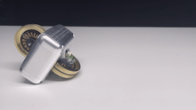

<!--  -->
<!--  -->
<div align="center">
  
  
  
</div>

<div align="center">
  
  
  
</div>

# The Mini Wheelbot

The Mini Wheelbot is a **balancing, reaction wheel
unicycle robot** designed as a testbed for learning-based control.
It is an unstable system with highly nonlinear yaw dynamics, non-holonomic driving, and discrete contact switches in a small, powerful, and rugged form factor. 
The Mini Wheelbot can use its wheels to stand up from any initial orientation – enabling automatic environment resets in repetitive experiments.

## Videos
An overview of Wheelbot Hardware is available here:
[](https://youtu.be/_d7AqTRjz6g)

## Citation
The Mini Wheelbot is introduced in the paper:
[Henrik Hose, Jan Weisgerber, and Sebastian Trimpe. **"The Mini Wheelbot: A Testbed for Learning-based Balancing, Flips, and Articulated Driving"**, accepted to the IEEE International Conference on Robotics and Automation ICRA (2025).](http://arxiv.org/abs/2502.04582)

Please cite our paper on the Mini Wheelbot:
```bibtex
@inproceedings{hose2025miniwheelbot,
    title={The Mini Wheelbot: A Testbed for Learning-based Balancing, Flips, and Articulated Driving},
    author={Hose, Henrik and Weisgerber, Jan and Trimpe},
    year={2025},
    booktitle={2025 IEEE International Conference on Robotics and Automation (ICRA)}
}
```

## Papers using the Mini Wheelbot Hardware
The following papers use Mini Wheelbot:
- [Henrik Hose, Jan Weisgerber, and Sebastian Trimpe. **"The Mini Wheelbot: A Testbed for Learning-based Balancing, Flips, and Articulated Driving"**, accepted to the IEEE International Conference on Robotics and Automation ICRA (2025).](http://arxiv.org/abs/2502.04582)
- [Hose, Henrik, Paul Brunzema, Alexander von Rohr, Alexander Gräfe, Angela P. Schoellig, and Sebastian Trimpe. **"Fine-Tuning of Neural Network Approximate MPC without Retraining via Bayesian Optimization."** In CoRL Workshop on Safe and Robust Robot Learning for Operation in the Real World. 2024.](https://openreview.net/pdf?id=lSah6an1Ar)


## Structure of this Repo
This repo contains the following materials:
- [**PCB Schematics**](./hardware/schematic/): PCBs used on the Mini Wheelbot
- [**Meshes**](./hardware/meshes/): for visualization
- [**Wheelbot-Lib**](./wheelbot-lib/): C++20 code running on the Mini Wheelbots Buildroot Linux
- [**Scripts**](./wheelbot-lib/scripts/): Collection of Python Scripts used for system identification, keyboard control, etc.
- [**Simulation**](./simulation/): ODEs describing the Mini Wheelbot's dynamics in different Python and simulation in Acados.
- [**Microcontroller software**](./hardware/microcontroller-software/) running on STM32 microcontrollers on the Mini Wheelbot.


## Related Repos and Acknowledgements
Related repositories:
- [**Yaw control neural network approximate MPC**](https://github.com/hshose/mini-wheelbot-ampc): Dataset synthesis and neural network training in Jax for nonlinear yaw control on the Mini Wheelbot.

The Mini Wheelbot's development has been made possible thanks to these open-source projects:
- [**modm**](https://modm.io/): A modern C++ barebone embedded library generator
- [**KiCAD**](https://www.kicad.org/): A Cross Platform and Open Source Electronics Design Automation Suite
- [**CasADi**](https://web.casadi.org/): A symbolic framework for numeric optimization implementing automatic differentiation
- [**Buildroot**](https://buildroot.org/): A tool to generate embedded Linux systems through cross-compilation.
- [**acados**](https://github.com/acados/acados): Fast and embedded solvers for nonlinear optimal control.
- [**µMotor**](https://github.com/roboterclubaachen/micro-motor): A motor controller for BLDC and DC motors up to 250W.
- [**JAX**](https://jax.readthedocs.io.): Composable transformations of Python+NumPy programs.

## Contact
If you are interested in building your own Mini Wheelbot, [contact us](https://www.dsme.rwth-aachen.de/cms/dsme/das-institut/team/~ujxgg/henrik-hose/?lidx=1).