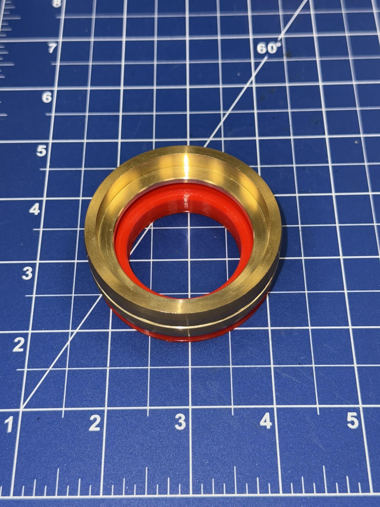
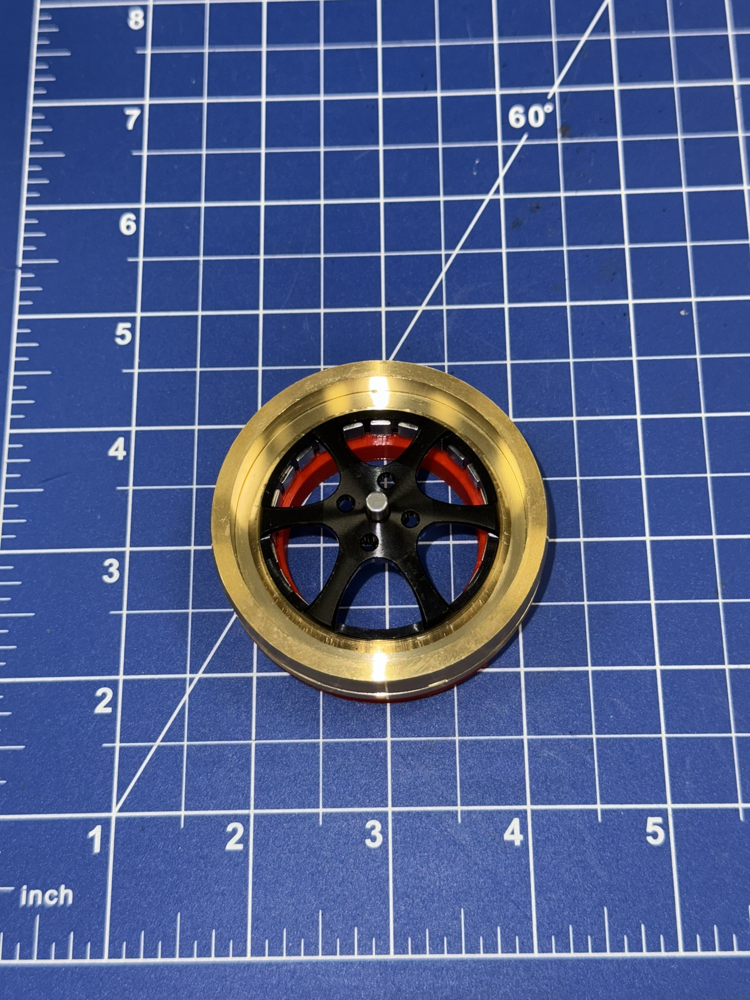
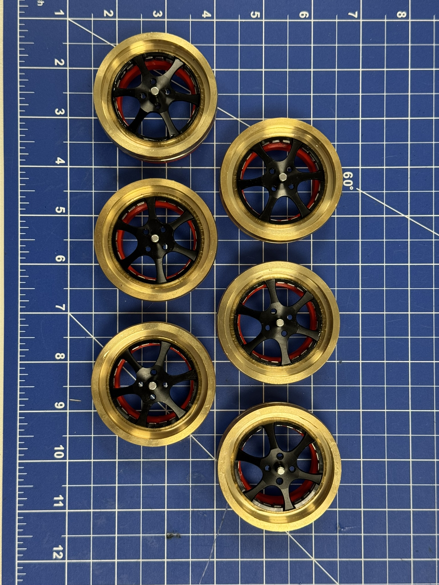
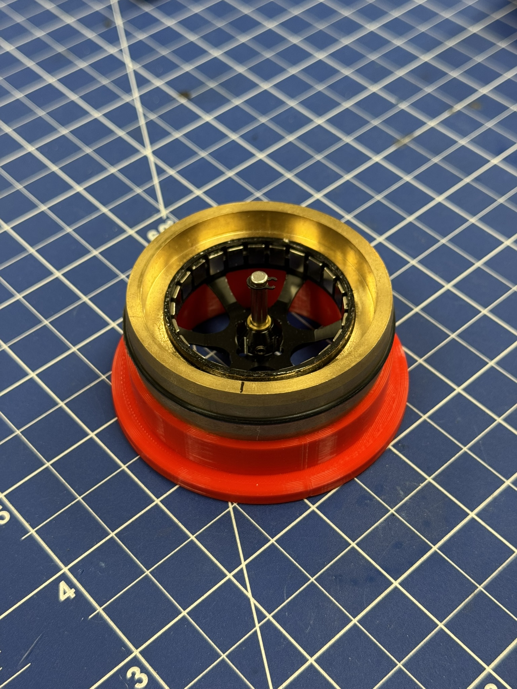
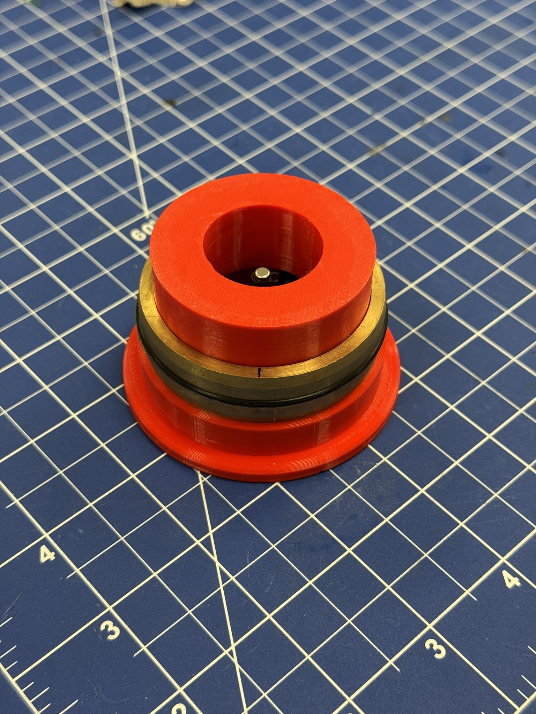
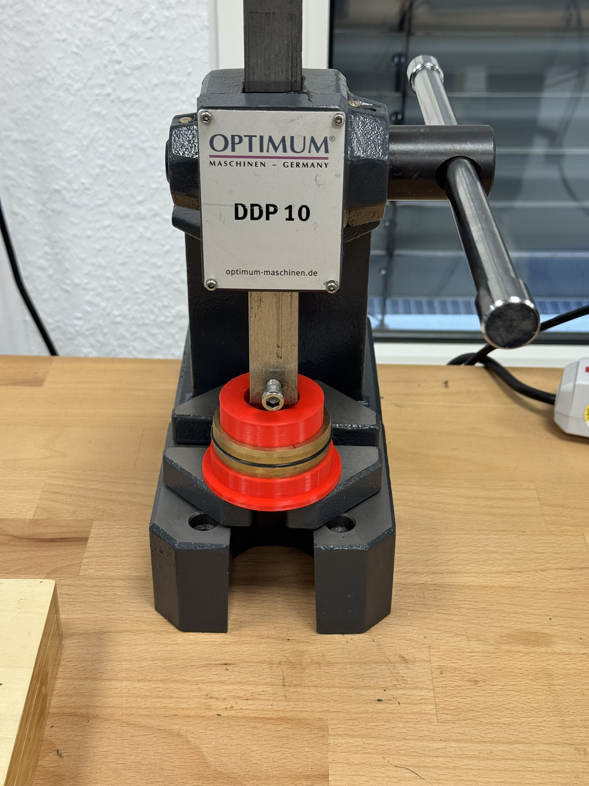
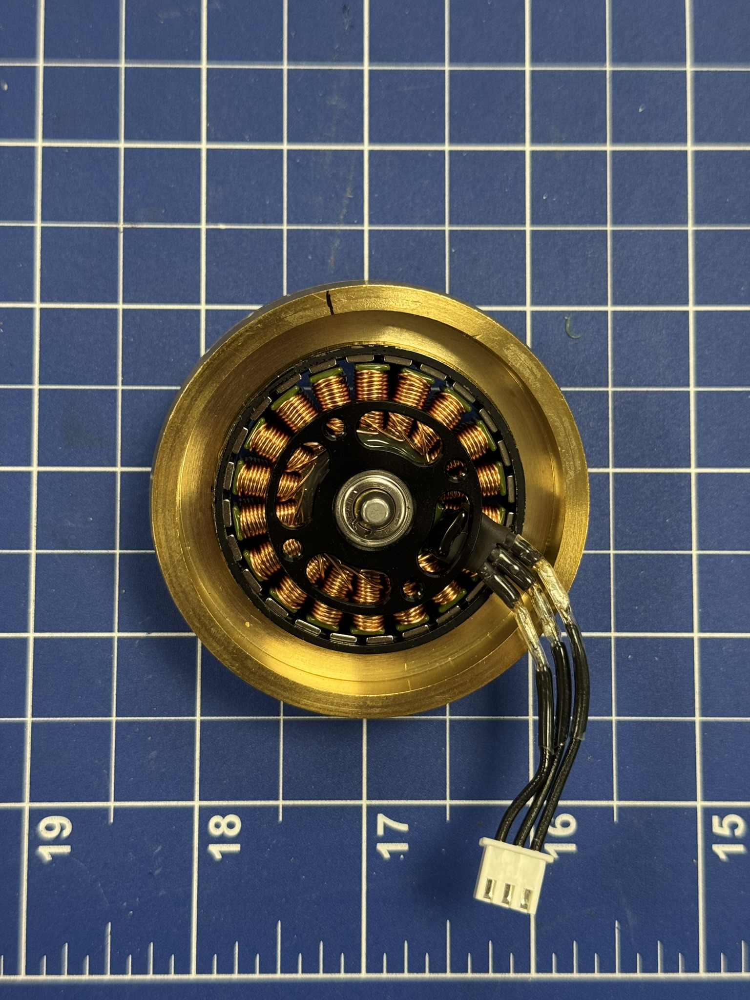

# Assembling the Motors

## Prepare Parts and Fixtures
Depending on the motor version, use the matching 3D-printed fixture:
- motor_fixture_MN4006.stl fixture for MN4006
- motor_fixture_MN4006_EVO.stl fixture for MN4006 EVO

Have the following parts and tools ready:
- Brass wheel
- Motor rotor
- Fast-curing epoxy (for example, 5-minute epoxy)

Make sure the brass wheel bore and rotor outer surface are clean and free of grease before gluing.

## Disassemble Motor and Prepare Stator
Before bonding the wheel to the rotor, disassemble the motor so rotor and stator are separated.

After separating rotor and stator, solder the stator phases to JST-XH pre-crimp cables (depicted in [how-to-assemble-robot.md](how-to-assemble-robot.md)).

## Place Wheel in Fixture
Place the brass wheel in the fixture first.
Check that it sits fully seated and flat in the fixture.
If the wheel is tilted at this stage, the final assembly can become imbalanced.

For the MN4006 EVO version, snapping the rotor into the fixture can require noticeable force.
Apply force only in the intended insertion direction and avoid side loading.

<table align="center">
  <tr>
    <td align="center">
       
    </td>
  </tr>
</table>

## Apply Epoxy and Insert Rotor
Spread fast-curing epoxy around the outside of the rotor.
Use only as much as needed for a continuous thin bond line to avoid excessive squeeze-out.

Insert the rotor into the brass wheel while it is supported by the fixture.
During insertion, rotate the rotor slightly to distribute epoxy evenly over the full circumference.

Once the rotor is inserted, apply vertical pressure onto the rotor-wheel stack.
This seats both components to the correct axial position.

<table align="center">
  <tr>
    <td align="center">
       
    </td>
  </tr>
</table>

## Align and Check Flatness
With light downward preload still applied, rotate the brass wheel on the fixture.
Do this for two reasons:
1. To help spread epoxy uniformly around the interface.
2. To verify the wheel sits flat without wobble.

If you detect visible tilt or wobble before curing, correct alignment immediately.

## Let Epoxy Cure
Leave the assembly in the fixture and allow the epoxy to cure for the full time specified by the epoxy manufacturer.
Do not disturb the assembly during this period.

Avoid handling early, as partial cure can still cause misalignment.

<table align="center">
  <tr>
    <td align="center">
       
    </td>
  </tr>
</table>

## Remove Fixture
After full cure, remove the fixture from the rotor-wheel assembly.
This can require some force if epoxy has spilled onto the fixture.

Do not reuse the 3D-printed fixture for another wheel-rotor assembly.
Glue residues can alter alignment and reduce repeatability on future builds.

## Rework an Imbalanced Assembly
If the wheel-motor assembly is imbalanced, press the rotor back out of the brass wheel using the motor removal fixture and punches.

Use this sequence:
1. Use the short punch first to break the epoxy bond.
2. Then use the long punch to fully press the rotor out of the wheel.

After disassembly, clean residual adhesive from mating surfaces before attempting a new assembly.

<table align="center">
  <tr>
    <td align="center">
       
    </td>
    <td align="center">
       
    </td>
    <td align="center">
       
    </td>
  </tr>
</table>

## Reinforce Second Side of the Bond and Reassemble Motor
After the first bond has cured and alignment is confirmed, reinforce the second side of the rotor-wheel bond.
Spread epoxy along the outer edge between rotor and wheel to create a secondary fillet bond.
This can be done best using a syringe and a flat wide-lumen needle.

Let this reinforcement epoxy cure for the full time specified by the manufacturer.
After curing, reassemble the rotor-wheel assembly with the stator.

<table align="center">
  <tr>
    <td align="center">
       
    </td>
  </tr>
</table>
