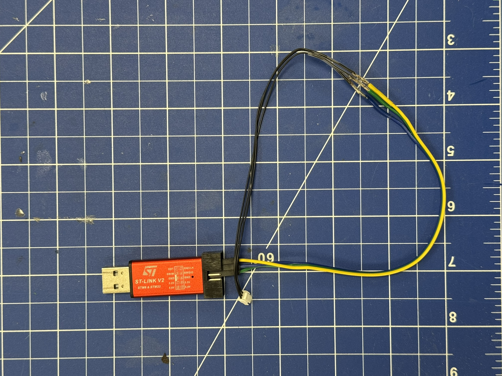
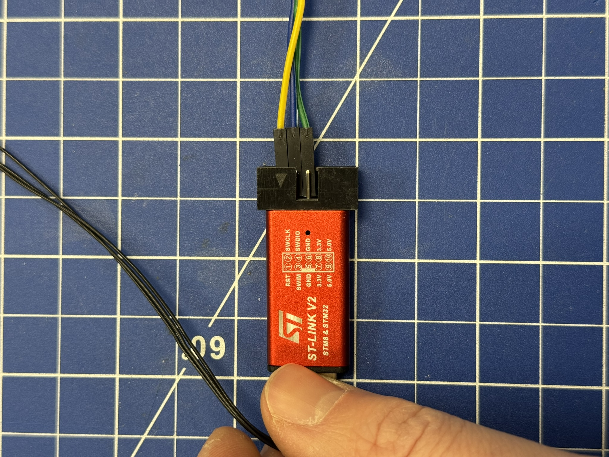
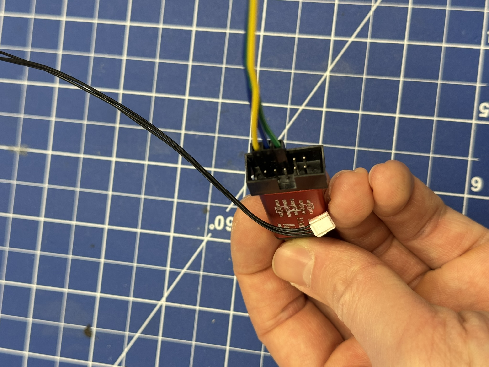
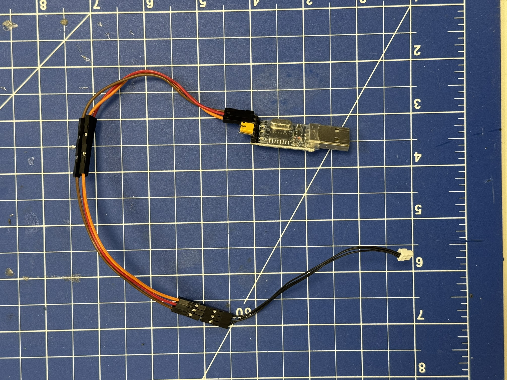
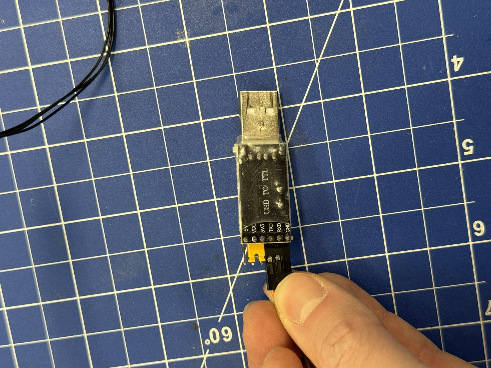
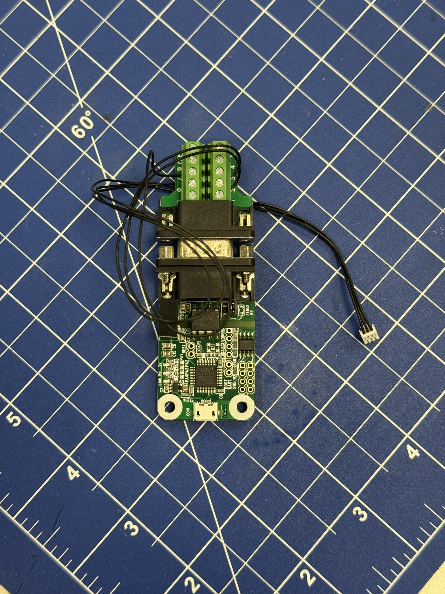
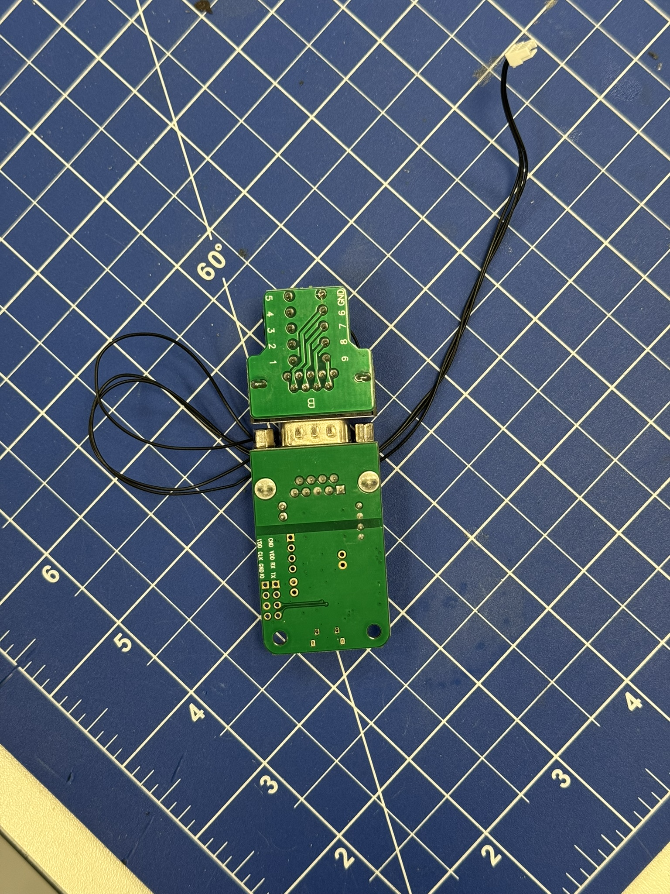
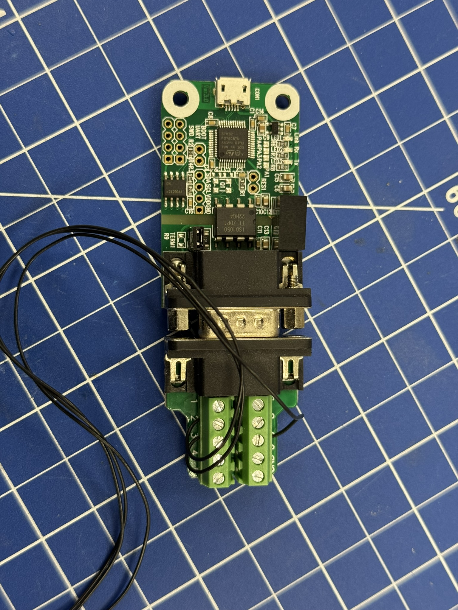

# Assembling the Tools

This guide explains how to assemble the three tool connectors listed in the Tools section of the [bill-of-materials.md](bill-of-materials.md):
- ST-Link V2 SWD adapter cable
- TTL-to-USB UART adapter cable
- USB-to-CAN adapter cable

## General Notes
Use JST-GH 6in precrimped wires and JST GH 3-pin housings.
Each adapter uses one 3-pin JST-GH cable.

Before plugging into any PCB:
- Verify pin order at the JST-GH connector.
- Verify continuity from tool-side pin to JST-GH contact.
- Avoid short circuits between adjacent pins.

## Assemble ST-Link V2 Adapter Cable
Prepare 3 wires:
1. Take 3 female jumper wires.
2. Cap/insulate one end of each jumper as needed.
3. Solder the other end of each jumper wire to 3 JST-GH 6in precrimp wires.
4. Add insulation (for example heat shrink) over each solder joint.

Insert the 3 JST-GH crimp contacts into one JST GH 3-pin housing.
Then connect the 3 female jumper ends to the ST-Link V2 pins:
- `SWCLK`
- `SWDIO`
- `GND`

Arrange the three wires in the JST-GH housing such that the final JST-GH pinout matches the SWD header pinout on the Mini Wheelbot PCBs.

<table align="center">
  <tr>
    <td align="center">
       
    </td>
    <td align="center">
       
    </td>
    <td align="center">
       
    </td>
  </tr>
</table>

## Assemble UART Adapter Cable
Prepare 3 wires in the same way as for the ST-Link cable:
1. Take 3 female jumper wires.
2. Cap/insulate one end.
3. Solder to 3 JST-GH 6in precrimp wires.
4. Insulate each solder joint.

Insert the JST-GH crimps into one JST GH 3-pin housing.
Then connect the jumper ends to the TTL-to-USB adapter pins:
- `TXD`
- `RXD`
- `GND`

Arrange the JST-GH pin order so it matches the PCB UART header.
If communication does not work, check TX/RX orientation first.

<table align="center">
  <tr>
    <td align="center">
       
    </td>
    <td align="center">
       
    </td>
  </tr>
</table>

## Assemble CAN Adapter Cable
Assemble the USB-to-CAN adapter with the CAN pin terminal first.

Prepare the JST-GH side:
1. Take 3 JST-GH 6in precrimp wires.
2. Insert them into one JST GH 3-pin housing.

Connect the wire ends to the CAN pin terminal as:
- `CANL`
- `CANH`
- `GND`

Arrange the JST-GH pin order so this mapping matches the CAN header pinout on the Mini Wheelbot PCBs.

<table align="center">
  <tr>
    <td align="center">
       
    </td>
    <td align="center">
       
    </td>
    <td align="center">
       
    </td>
  </tr>
</table>

## Final Check
For each assembled adapter cable:
1. Check connector orientation against the PCB silkscreen before first use.
2. Verify pin mapping and continuity with a multimeter.
3. Common failures during flashing are broken cables, jumpers not connected, wiring mixed up.
