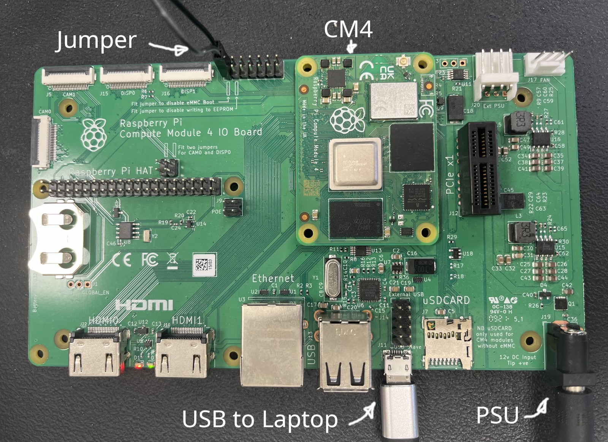

# Flashing the CM4 eMMC

This guide explains how to build the CM4 Buildroot image, flash it to the CM4 eMMC using the official CM4 IO board, and log in to the system for the first time.

## Materials needed

- CM4 with eMMC and Wi-Fi
- Official CM4 IO board
- Micro-USB cable for the CM4 IO board USB slave port (`J11`)
- Power supply for the CM4 IO board (`J19`)

## Configure default network and login credentials

The generated image is configured to:

- connect to Wi-Fi SSID `botnet` with password `botnet`
- use hostname `wheelbot`
- allow login as user `root` with password `wheelbot`

The Wi-Fi credentials are defined here:
[cm4-software/wheelbot_tree/board/common/wpa_supplicant.conf](cm4-software/wheelbot_tree/board/common/wpa_supplicant.conf)

The default root password is defined here:
[cm4-software/wheelbot_tree/configs/wheelbot_cm4_defconfig](cm4-software/wheelbot_tree/configs/wheelbot_cm4_defconfig)

If you do not want to ship images with these defaults, change them before building.

## Build the image on the host

Install the required Buildroot host packages from the [official Buildroot documentation](https://buildroot.org/downloads/manual/manual.html#requirement).

From the repository root, make sure the Buildroot submodule is present:

```bash
git submodule update --init --recursive hardware/cm4-software/buildroot
cd hardware/cm4-software/buildroot
```

Configure Buildroot for the Wheelbot CM4 image:

```bash
make defconfig BR2_DEFCONFIG=../wheelbot_tree/configs/wheelbot_cm4_defconfig
```

Build the image. The first build usually takes 20 to 60 minutes:

```bash
make BR2_EXTERNAL=/absolute/path/to/mini-wheelbot/hardware/cm4-software/wheelbot_tree
```

The flashable image will be written to:

```text
hardware/cm4-software/buildroot/output/images/sdcard.img
```

## Optional: build the image using Docker

If you prefer not to install the Buildroot host dependencies locally, you can use the provided Dockerfile.

From the repository root, build the container image:

```bash
docker build -t wheelbot-cm4-build -f hardware/cm4-software/docker/Dockerfile hardware/cm4-software/docker
```

Then run the Buildroot build inside the container:

```bash
docker run --rm -it \
  --user "$(id -u):$(id -g)" \
  -e HOME=/tmp \
  -v "$(pwd)/hardware/cm4-software:/work" \
  -w /work/buildroot \
  wheelbot-cm4-build \
  bash -lc 'make defconfig BR2_DEFCONFIG=../wheelbot_tree/configs/wheelbot_cm4_defconfig && make BR2_EXTERNAL=/work/wheelbot_tree'
```

This produces the same output image on the host at `hardware/cm4-software/buildroot/output/images/sdcard.img`.

## Flash the eMMC on the CM4

1. Put the CM4 on the official IO board.
2. Fit the `J2` jumper to disable normal eMMC boot and enable USB boot mode.
3. Connect the IO board to your computer with a micro-USB cable on `J11`.
4. Prepare power for the IO board on `J19`, but do not power it on yet.

The result should look like this:
<table align="center">
  <tr>
    <td align="center">
      <br/>
    </td>
  </tr>
</table>

You need [`rpiboot`](https://github.com/raspberrypi/usbboot) on your host to expose the eMMC as a block device.
You can either install it on your machine or use the copy built by Buildroot at `hardware/cm4-software/buildroot/output/host/bin/rpiboot`.

Start `rpiboot` on the host:

```bash
rpiboot
```

Then power on the CM4 IO board. You should see output similar to:

```text
$ rpiboot
RPIBOOT: build-date Jul 10 2023 version 20221215~105525 c4b12f85
Waiting for BCM2835/6/7/2711...
Loading embedded: bootcode4.bin
Sending bootcode.bin
Successful read 4 bytes
Waiting for BCM2835/6/7/2711...
Loading embedded: bootcode4.bin
Second stage boot server
Cannot open file config.txt
Cannot open file pieeprom.sig
Loading embedded: start4.elf
File read: start4.elf
Cannot open file fixup4.dat
Second stage boot server done
```

Identify the new block device with `lsblk`. A disk such as `/dev/sdX` should appear.
Make sure you pick the whole device and not one of its partitions.

If your desktop auto-mounted any partitions from the CM4 eMMC, unmount them before flashing.

From `hardware/cm4-software/buildroot/output/images`, write `sdcard.img` to the detected device:

```bash
cd hardware/cm4-software/buildroot/output/images
sudo dd if=sdcard.img of=/dev/sdX bs=64K status=progress conv=fsync
sync
```

After flashing finishes:

1. Power off the CM4 IO board.
2. Remove the `J2` jumper so the CM4 boots from eMMC again.
3. Disconnect the micro-USB cable.

## First boot and access

While the CM4 is still on the IO board, you can connect a monitor, keyboard, and mouse and verify that Buildroot boots.

After moving the CM4 to the Wheelbot compute carrier, it should connect to the configured Wi-Fi automatically and request an IP address via DHCP on `wlan0`.

You can then log in over SSH as `root`:

```bash
ssh root@<cm4-ip-address>
```

The default password is:

```text
wheelbot
```

If you do not know the IP address, check your router or scan the local network for hostname `wheelbot`.
