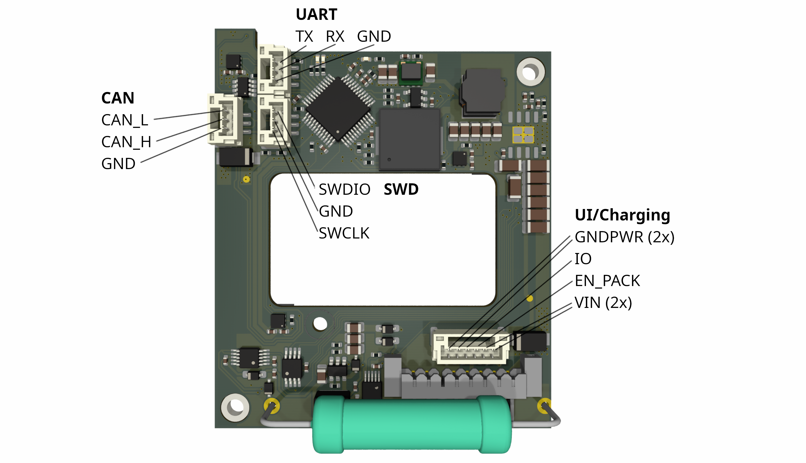
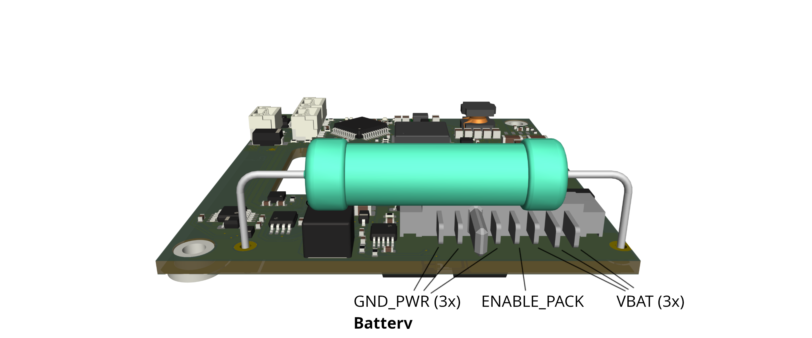
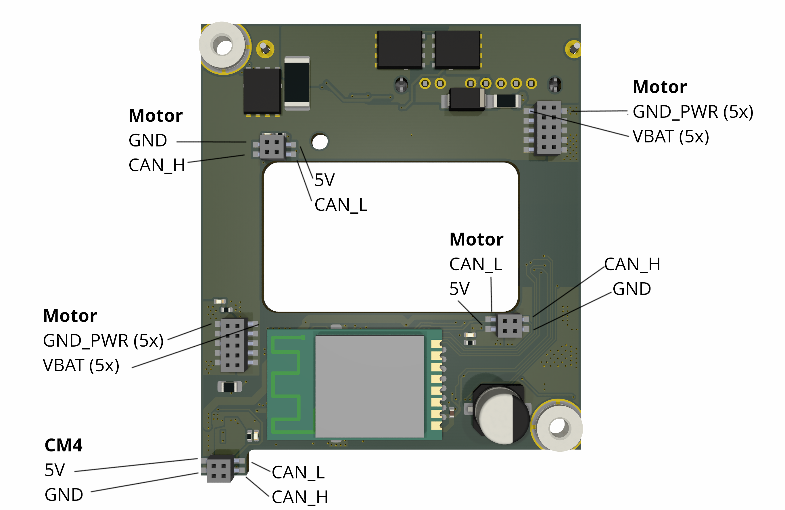
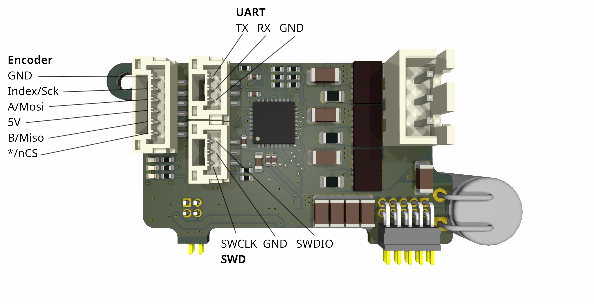
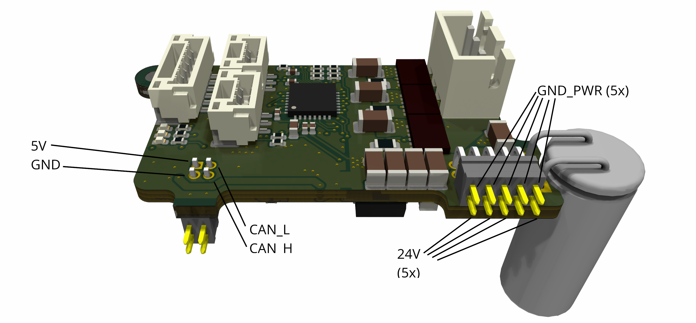

# Flashing Firmware to the PCBs

This guide explains how to flash the shipped firmware to the three STM32 microcontrollers:
- 1x on the power distribution board
- 2x on the motor controller boards

## OpenOCD on Linux (Short Introduction)
OpenOCD (Open On-Chip Debugger) is used to program STM32 microcontrollers via SWD, for example with an ST-Link V2.

Install OpenOCD on Linux:

```bash
sudo apt update
sudo apt install -y openocd
```

You will also need:

```bash
sudo apt install -y can-utils picocom
```

`can-utils` is used for `cansend` and `picocom` is used for UART log output.

## 1. Flash the Power Distribution Board

### Hardware Setup (Robot Not Assembled)
1. Connect the charging PCB to the power distribution board.
2. Do not connect motor controller boards yet.
3. Connect the battery to the power distribution board.
4. Connect the ST-Link adapter, UART adapter, and CAN adapter to the corresponding headers on the power distribution board.
5. Power on using the ON/OFF switch on the charging PCB.

<table align="center">
  <tr>
    <td align="center">
      <br/>
    </td>
    <td align="center">
      <br/>
    </td>
    <td align="center">
      <br/>
    </td>
  </tr>
</table>

### Flash Command
Flash `power-distribution.elf`:

```bash
openocd \
  -f interface/stlink.cfg \
  -f target/stm32g4x.cfg \
  -c "program microcontroller-software/power-distribution.elf verify reset exit"
```

### Verify via UART
After flashing, power-cycle the power distribution board and check UART logs:

```bash
picocom /dev/ttyUSB0 -b 460800 --imap lfcrlf
```

If UART output appears after power-cycle, flashing of the power distribution board is complete.

## 2. Flash the Motor Controllers

### Hardware Setup
1. Turn battery power off.
2. Connect both motor controller boards to the power distribution board.
3. Keep the CAN adapter connected to the power distribution board.
4. Connect ST-Link and UART adapters to one motor controller board.
5. Power on the system using the ON/OFF switch on the charging PCB.

At this point, motor controllers are not powered yet.

<table align="center">
  <tr>
    <td align="center">
      <br/>
    </td>
    <td align="center">
      <br/>
    </td>
  </tr>
</table>

### Enable Motor Controller Power via CAN
Bring up CAN and enable motor controller power:

```bash
ip link set can0 type can bitrate 1000000 && ip link set up can0
cansend can0 040#02
```

For CAN message details, see [how-to-set-motor-controller-IDs.md](how-to-set-motor-controller-IDs.md).

### Set BOOT0 Option
Run:

```bash
openocd -f interface/stlink.cfg -c "transport select hla_swd" -f target/stm32g4x.cfg -c "reset_config none" -c "init" -c "stm32g4x option_write 0 0x20 0x00000000 0x04000000" -c "shutdown"
```

### Flash Firmware
Flash `micro-motor.elf`:

```bash
openocd \
  -f interface/stlink.cfg \
  -f target/stm32g4x.cfg \
  -c "program microcontroller-software/micro-motor.elf verify reset exit"
```

### Wipe Motor Controller Config Region
Run:

```bash
openocd -f interface/stlink.cfg -f target/stm32g4x.cfg   -c "init"   -c "reset halt"   -c 'flash erase_address 0x08070000 0x00010000'   -c 'flash fillw 0x08070000 0x00000000 16384'   -c "reset run"   -c "exit"
```

Repeat the motor controller flashing steps for the second motor controller board.

### Verify via UART

If UART output appears after power-cycle, flashing of the motor controller board is complete. Remember, that in order to power the motor controllers, one has to send a can command.
To power cycle the motor controllers without power-cycling the power distribution board, send these two commands with short delay.
```bash
cansend can0 040#01
cansend can0 040#02
```

## 3. Next Step: Set Motor Controller IDs
After both motor controller boards are flashed, the PCBs are ready to be assembled.

Motor controller IDs can be set either:
- outside of the robot with external CAN adapter:
  [setMotorControllerIDs_external.py](../wheelbot-lib/scripts/micro-motor/setMotorControllerIDs_external.py)
- after assembly on the CM4:
  [setMotorControllerIDs_cm4.py](../wheelbot-lib/scripts/micro-motor/setMotorControllerIDs_cm4.py)
